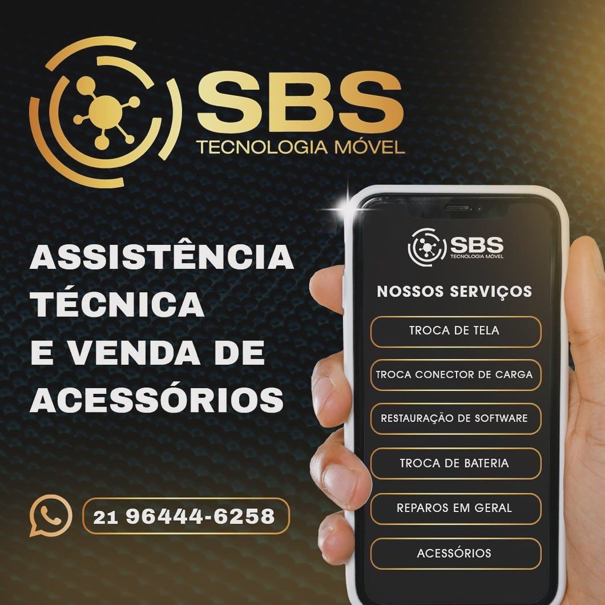

<h1 align="center" style="color:#1E90FF;">👋 Olá, eu sou a Jeniffer Carvalho</h1>

  <b style="color:#1E90FF;">💻 Desenvolvedora Full Stack | Suporte Técnico </b>

  

---

## 💻 Sobre mim

👩‍💻 Profissional de Tecnologia da Informação com experiência em suporte técnico, help desk, manutenção de sistemas e rotinas administrativas.  
  
🎯 Atuo com foco em resolução de problemas, atendimento ao usuário e apoio a sistemas internos.  
  
🚀 Estou em constante evolução na área de TI, buscando crescimento profissional e novos desafios na área de desenvolvimento e suporte.

---

Atuo na área de Tecnologia da Informação com experiência em suporte técnico, manutenção de sistemas, rotinas administrativas e apoio em processos financeiros.  
  
Estou sempre em busca de crescimento profissional e novos desafios na área de TI e desenvolvimento.

---

## 🧠 Stack Tecnológica

  

---

## 🖥️ Ambiente de Trabalho

┌──────────────────────┐ 
│      WORKSTATION     │ 
│   Full Stack Mode    │ 
└─────────┬────────────┘ 
&nbsp;&nbsp;&nbsp;&nbsp;&nbsp;&nbsp;&nbsp;&nbsp;&nbsp;&nbsp;&nbsp;&nbsp;│ 
┌─────────▼────────────┐ 
│   💻 DEV TERMINAL    │ 
│  Code • Debug • Build│ 
└──────────────────────┘

---

## 📊 Experiência Profissional

- 🖥️ Suporte técnico ao usuário (help desk), auxiliando na resolução de problemas com sistemas, computadores e impressoras  
- 🖨️ Apoio na manutenção básica de impressoras e equipamentos de escritório (troca de cartuchos, identificação de falhas e suporte ao funcionamento)  
- 📊 Atuação como Assistente Administrativo e Financeiro, com organização de rotinas administrativas e apoio operacional  
- 💳 Controle e apoio em processos financeiros, incluindo organização de pagamentos e rotinas internas da empresa  
- 🔧 Suporte ao gestor de TI em demandas do dia a dia, auxiliando na operação de sistemas internos e resolução de incidentes  

---

### 📌 SBS Tecnologia Móvel
🔗 https://sbstecnologiamovel  
🧠 Projeto institucional voltado para tecnologia e soluções móveis, com foco em serviços e suporte.

  

---

### 📌 Nutri Ana Clara Almeida
🔗 http://nutrianaclaraalmeida  
🧠 Projeto institucional na área da saúde e nutrição, com foco em apresentação profissional e serviços.

  

---

## 🎯 Objetivo Profissional

Atuar como profissional de TI ou suporte técnico, contribuindo com soluções eficientes, aprendizado contínuo e crescimento dentro da área de tecnologia e desenvolvimento.

---

## 📫 Contato

💼 LinkedIn: <a href="https://www.linkedin.com/in/jeniffercarvalho" style="color:#1E90FF;">jeniffercarvalho</a>  

📧 Email: <a href="mailto:jeni.silva.sj@gmail.com" style="color:#1E90FF;">jeni.silva.sj@gmail.com</a>  

📱 WhatsApp: <a href="https://wa.me/5521994267733" style="color:#1E90FF;">21 99426-7733</a>

---

⭐ "Tecnologia é transformar problemas em soluções." ⭐

